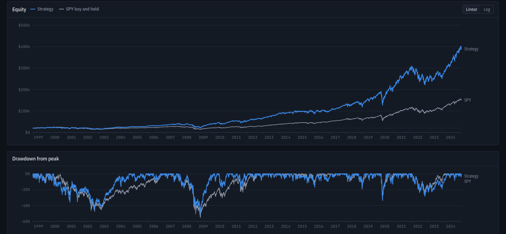
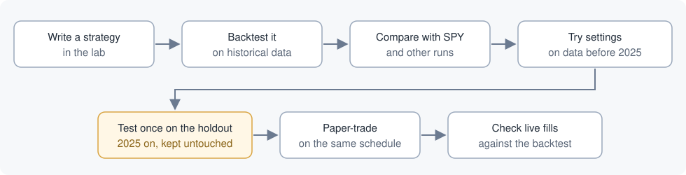
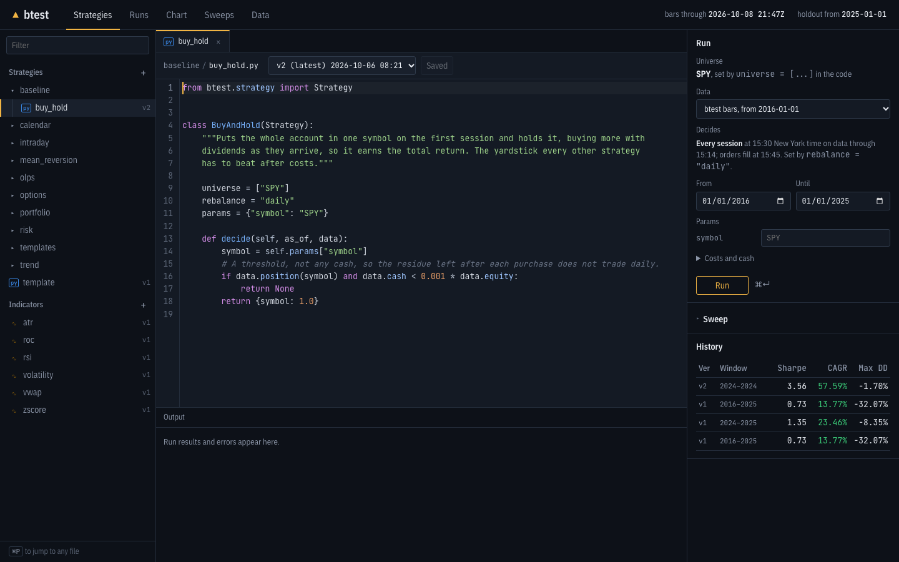
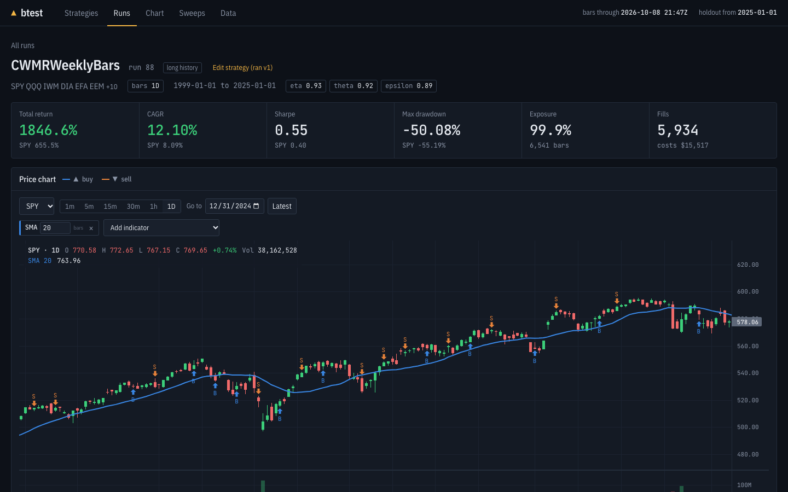
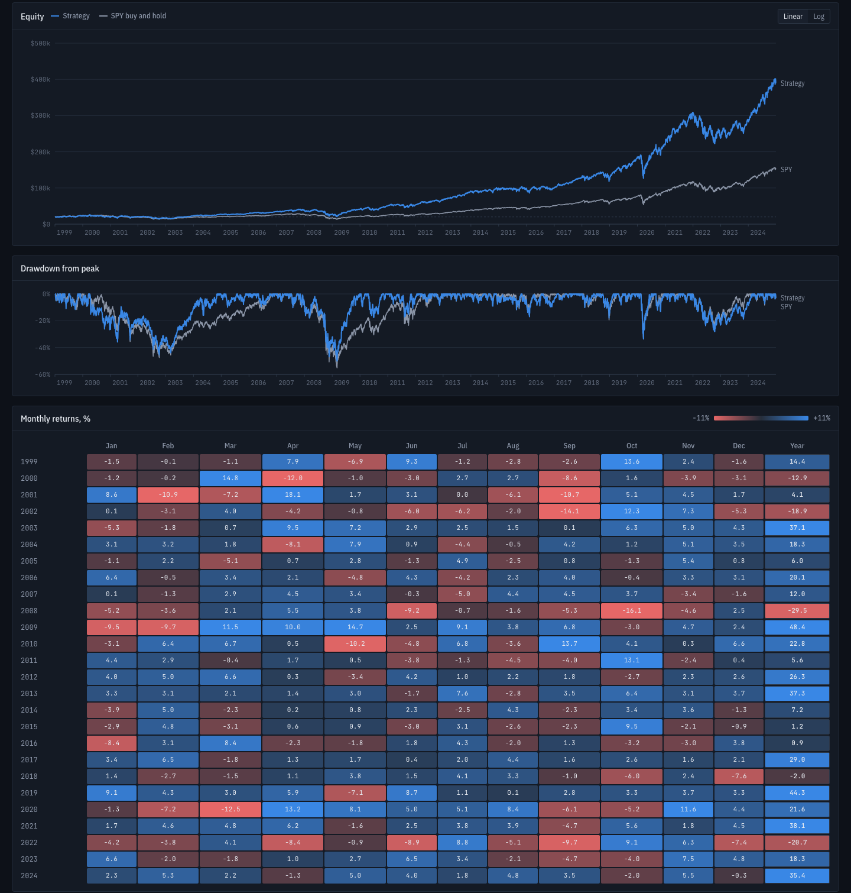
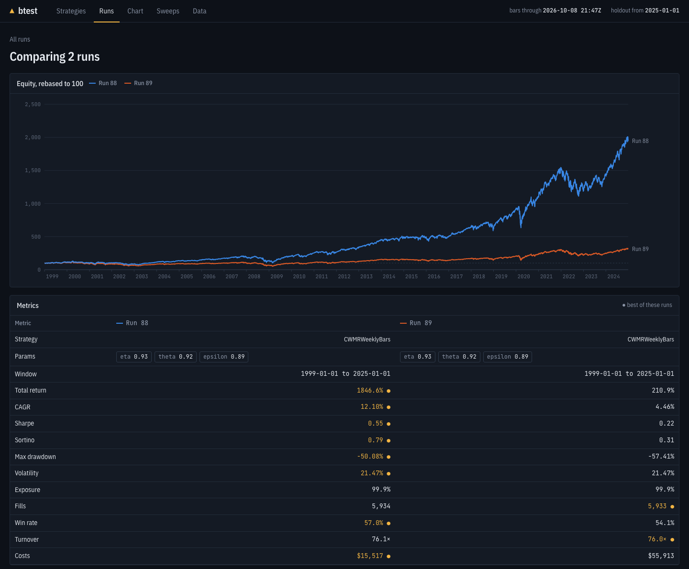
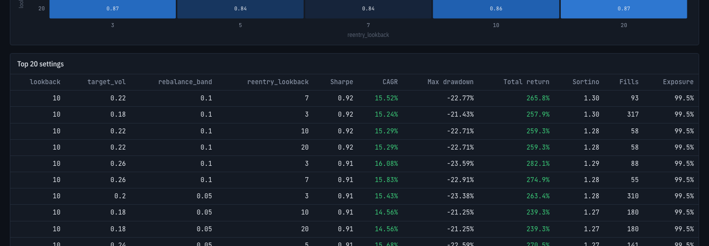
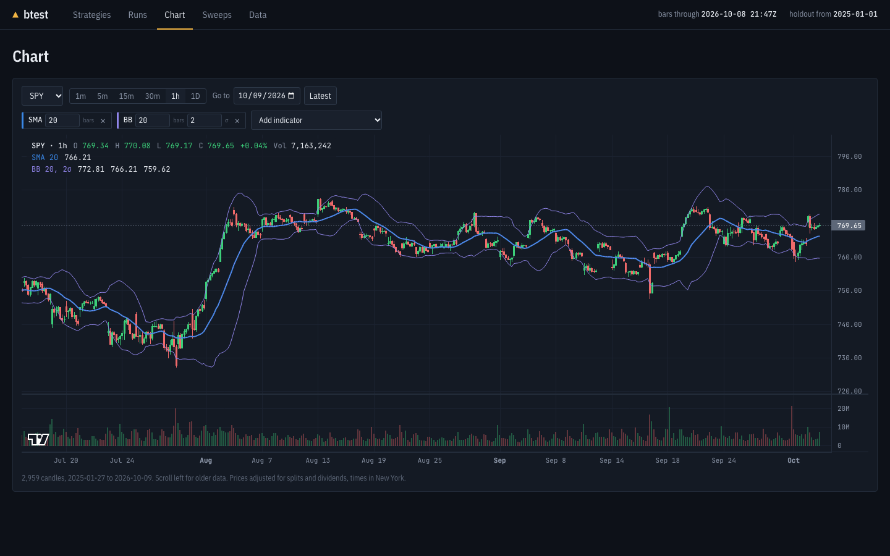

# btest

btest is a workbench for testing trading ideas before risking money on them. You write a
strategy, run it on years of real US market data with realistic trading costs, compare it with
simply holding the market, and, if it still looks good, paper-trade it on the same schedule the
backtest assumed.



## Who this is for

- **Product people, analysts and anyone judging a strategy.** You do not need to read code.
  The website shows every result, and the sections below explain what the numbers mean and
  what btest does to stop a backtest from looking better than real trading would.
- **Programmers who write strategies.** A strategy is a short Python file. The
  [developer reference](#for-developers) covers setup, the command line and the engine.

## How a strategy goes from idea to paper trading



Each step has a screen on the website.

### Write a strategy

The lab is a code editor in the browser. Every save is a new version, and every result is tied
to the exact version that produced it, so a good result can always be traced back to its code.



### Backtest it and read the result

A run shows the headline numbers next to SPY's (an S&P 500 index fund, the usual benchmark), and
a price chart with every buy and sell.



Below that are the equity curve, the drawdowns and a month-by-month table. A strategy can beat
SPY overall and still lose half its value along the way; the drawdown chart shows that.



### Compare runs

Tick two to four runs to overlay them. Here the same strategy runs at two trading-cost levels,
0.7 and 10 basis points per dollar traded: the costs alone take it from beating SPY to trailing
it.



### Try settings without fooling yourself

A sweep runs every combination of a strategy's settings and maps the results, so you can see
whether a good setting sits in a stable region or is a lucky spike. Sweeps never touch the
holdout (see below).



### Look at the market itself

The Chart tab shows any symbol from 1-minute to daily candles, with indicators, on the same
split- and dividend-adjusted prices the backtests use.



## How btest keeps results honest

Most backtests look better than real trading. btest is built around the usual reasons why:

- **No trading on prices the strategy has already seen.** A strategy decides on data up to a
  point and its order fills at the next available price. For portfolio strategies that is the
  same schedule as live trading: decide at 15:30 New York time on data through 15:14 (the free
  market data feed runs 15 minutes behind), fill at 15:45.
- **Costs are charged.** Every trade pays a spread cost and the SEC fee on sales; minute-bar
  strategies can also be charged a commission per share.
- **A holdout nobody tunes on.** Data from 2025 on is kept aside. Sweeps stop before it, and
  `btest run` warns how many times a strategy has already been tested on it, since every look
  makes it less of a fair test.
- **Benchmarks that are hard to beat.** Results are shown against SPY, and the research also
  compares with an equal-weight portfolio of the same funds, which tells you whether the
  strategy added anything beyond the choice of funds.
- **Two engines that must agree.** The fast engine used for sweeps must produce the same trades
  as the main engine; `btest parity` checks this on real data.
- **Live trading is checked against the backtest.** After each paper-trading session btest
  compares every fill with the price the backtest would have used, and a daily-loss limit
  switches a deployment off.

## What the research found

btest was used to test a published claim that "online portfolio selection" algorithms, which
move money from recent winners to recent losers, multiply wealth hundreds of times. The working
paper ([PDF](docs/research/paper/cwmr-etf.pdf)) reproduces the original results exactly, then
tests the strongest algorithm on 16 US exchange-traded funds over 1999-2024. Its lead over
simply holding the same funds in equal weights is not statistically significant after
correcting for the comparisons made, and it depends on trading costs at the market open that
were never measured. A version chosen on recent data failed its pre-registered test on
2025-2026. The paper's claims are tied to their evidence by a checker that runs on every commit
([details](#the-papers-claim-check)); the replication code is at
[cwmr-etf-replication](https://github.com/yelgabo/cwmr-etf-replication).

## The numbers, in plain words

| Term | Meaning |
|---|---|
| Backtest | Running a strategy on past data as if it had traded then |
| CAGR | Compound annual growth rate: the steady yearly return that gives the same end result |
| Sharpe ratio | Return above a risk-free rate per unit of volatility; higher means a smoother ride for the same gain |
| Max drawdown | The largest fall from a previous high, in percent |
| Basis point (bp) | One hundredth of a percent; 0.7 bp per dollar traded is 7 cents on $1,000 |
| Turnover | How many times a year the strategy trades its whole account |
| Holdout | Data kept aside and used once, as a final test |
| Paper trading | Trading with simulated money at real-time prices through a broker |
| SPY | An S&P 500 index fund, the default benchmark |

## For developers

Design: [docs/superpowers/specs/2026-10-01-btest-design.md](docs/superpowers/specs/2026-10-01-btest-design.md).
Research: [docs/research/](docs/research/).

### Setup

Needs Python 3.12, [uv](https://docs.astral.sh/uv/) and PostgreSQL.

```sh
cp .env.example .env        # add Alpaca paper keys
createdb btest
uv sync
uv run btest migrate
```

### Tests

```sh
createdb btest_test && createdb btest_test_live   # the database tests skip without these
uv run pytest
```

### Data

```sh
uv run btest ingest                         # backfill, then incremental on later runs
uv run btest check-adjust                   # compare adjusted bars with Alpaca's
uv run btest bars NVDA 2024-06-07T19:50 2024-06-10T13:35
```

Symbols and history start live in `btest.toml`. Bars are stored under `data/bars/` as Parquet,
raw and unadjusted; corporate actions and the NYSE calendar live in Postgres.

### Backtests

```sh
uv run btest run strategies/trend/ma_cross.py SPY --start 2016-01-01 --end 2025-01-01 \
    -p fast=30 -p slow=390 --slippage-bps 1
uv run btest report 1                       # rewrite data/reports/run-1.html
```

A strategy is a Python file with one `btest.strategy.Strategy` subclass. Each run is stored in
the Postgres `runs` schema (params, git commit, fills, daily equity, metrics) and gets an HTML
report under `data/reports/`.

Bars load from `--start`, with no warm-up before it, so a strategy with a 200-day window sits
in cash for its first 200 sessions while the SPY benchmark is invested from the first close.

### Long history, 1995 on

```sh
uv run btest longhist                       # download the series into Postgres (about a minute)
uv run btest run strategies/olps/cwmr_monthly.py --data longhist --start 1995-01-03 --end 2016-01-01
```

A second data source for `decide()` strategies: Yahoo's daily adjusted closes for the symbols in
`btest.toml`, from 1995 or each symbol's first trading day (QQQ joins on 1999-03-10). Day bars,
so it is kept apart from the minute-bar store. A strategy decides on a session's close and
fills at the next session's open. Pick it per
run with `--data longhist` or the Data menu in the lab. Design:
`docs/superpowers/specs/2026-10-06-long-history-data.md`.

### Fast path, parity, sweeps

```sh
uv run btest parity strategies/trend/ma_cross.py SPY --start 2016-01-01 --end 2025-01-01
uv run btest sweep strategies/trend/ma_cross.py SPY --start 2016-01-01 \
    -g fast=5,10,30,60 -g slow=60:2340:60
```

`signals()` must give the same fills as `on_bar()`; `btest parity` checks that on real data.
Sweeps stop at `holdout_start` in `btest.toml`. Confirm a chosen setting on the holdout once
with `btest run`; it warns how many times that strategy has already looked at the holdout.

### UI

```sh
uv run btest ui                             # http://127.0.0.1:8765
```

Workbench over the runs and sweeps in Postgres: runs table, run detail (equity, drawdown,
monthly returns, fills), compare up to four runs, sweep parameter maps, data status, and the
strategy lab below.

### Strategy lab (website)

The Strategies tab is an editor: file tree (folders come from `/` in names), tabs, Cmd/Ctrl+P
to jump, Cmd/Ctrl+S to save (every changed save is a new version), Cmd/Ctrl+Enter to run.
Runs and sweeps are queued in `lab.job` and executed by `btest worker`, each in a child process
that connects as the restricted role in `BTEST_RUNNER_DATABASE_URL` (see `.env.example`) and has
a time limit. `btest
import-strategies` copies `strategies/*.py` into the lab.

The lab runs whatever Python is saved in it. The child process limits mistakes (time, memory,
database rights, no broker keys) but is not a sandbox for untrusted code: it runs as the same OS
user as the worker and has network access. Give the password only to people you would give a
shell.

### Strategies and indicators

| Strategy | Bars | Idea |
|---|---|---|
| `trend/ma_cross` | 1m | Fast / slow moving-average crossover |
| `mean_reversion/zscore` | 1m | Buy stretches below the rolling mean, sell on the snap back |
| `mean_reversion/rsi2` | 1D | Connors RSI(2) pullbacks inside a 200-day uptrend |
| `trend/sma_200` | 1D | Hold above the moving average, cash below |
| `trend/momentum_12m` | 1D | Hold while the 12-month return beats a hurdle, checked monthly |
| `risk/vol_target` | 1D | Always invested, sized to a target volatility |
| `intraday/opening_range` | 5m | Buy a break of the first 30 minutes' high, flat by 15:50 |

Indicators: `rsi`, `zscore`, `vwap`, `atr`, `volatility`, `roc`.

### Portfolio strategies

A strategy with a `decide(as_of, data)` method (start from `strategies/templates/portfolio.py`)
holds several symbols and trades on the live system's schedule: one decision per scheduled
session at 15:30 New York time on data through the 15:14 bar (the free SIP feed is 15 minutes
behind), orders filling at the 15:45 bar's open. Half days shift with the close. It declares
`universe = [...]` and `rebalance = "daily" | "weekly" | "month_end" | "month_start"` and
returns target weights, `Targets(...)` with option contracts, or `None` for no change.

The portfolio engine trades like a cash account: notional orders, sells before buys, no
leverage, fractional shares (on by default), idle cash earning the 3-month T-bill rate (on by
default), written puts fully secured by cash and assigned at expiry. Benchmark: SPY or 60/40.

```sh
uv run btest run strategies/portfolio/trend_gtaa.py --start 2016-01-01 --end 2025-01-01
uv run btest ingest-options XLF EEM          # monthly puts + 30-minute bars, Feb 2024 on
uv run btest run strategies/options/put_write.py --start 2024-02-01 --end 2025-01-01
```

| Strategy | Rebalance | Idea |
|---|---|---|
| `baseline/buy_hold` | once | All in one symbol, held |
| `portfolio/trend_gtaa` | month end | Five asset classes, each held only above its 10-month average |
| `portfolio/dual_momentum` | month end | US or international stocks, whichever is stronger, else bonds |
| `portfolio/sector_momentum` | month end | Top 3 sector ETFs by 6-month return, cash below SPY's 200-day |
| `mean_reversion/rsi2_basket` | daily | RSI(2) pullbacks across SPY, QQQ, IWM, DIA |
| `calendar/turn_of_month` | daily | SPY from the last session of a month to the third of the next |
| `risk/risk_parity` | month end | Stocks, bonds, gold by inverse volatility at a 10% vol target |
| `options/put_write` | daily | Cash-secured monthly puts on XLF |

`strategies/olps/` holds the online portfolio selection algorithms from Lahanis, Liu and Zhou's
NYU paper (follow-the-winner, follow-the-loser, pattern matching, meta-learning), built on
`btest.olps` and tested against the authors' code (`tests/test_olps.py`). Review and
replication: `docs/research/2026-10-04-online-portfolio-selection-paper.md`.

Sweeps of portfolio strategies wait for a portfolio fast path.

### Live trading (Alpaca paper)

The worker trades enabled deployments on the same timing: 15:30 refresh bars and run
`decide()` in the sandboxed child (no broker keys), 15:45 sell then buy, 16:15 read fills back
and compare each with the backtest's fill price. A kill switch disables a deployment after a
daily loss beyond `max_daily_loss`; orders above `max_order` x capital are refused. Strategies
see cash capped at the deployed capital even when the account holds more.

```sh
uv run btest live configure-account          # no margin, no shorting
uv run btest live deploy gtaa portfolio/trend_gtaa --capital 20000
uv run btest live decide gtaa --session 2026-10-02   # dry run: targets and orders
uv run btest live enable gtaa
uv run btest live list
```

### Timeframes

A strategy sets `timeframe = "1D"` (or `5m`, `15m`, `30m`, `1h`; default `1m`). The runner,
the fast path, sweeps and parity all build those bars from the minute data with the same
session bucketing as the charts, so windows in `params` count bars of that size, decisions
happen at each bar's close and orders fill at the next bar's open. Run pages open their chart
on the strategy's timeframe, where its indicators match exactly. Example:
`strategies/trend/sma_200.py`.

### Charts

Candlestick charts (TradingView's lightweight-charts) on every run page and in the Chart tab:
1m to 1D candles on New York session time, split- and dividend-adjusted like the backtests,
SMA / EMA / Bollinger overlays, and the run's fills as buy and sell markers. The chart loads
about 3,000 candles around the Go to date and fetches more as you scroll toward either edge
(capped at 400,000 loaded candles per chart). Indicators preset
from a strategy's params are set in minutes, so at 1m they equal what the strategy computed.
On Railway the web service has no bar files; it proxies `/api/candles` to the worker's private
bar service (`BTEST_BARS_URL`, shared `BTEST_INTERNAL_TOKEN`).

### Custom indicators

The Indicators section of the lab holds Python indicators (`btest.indicator.Indicator`):
`params`, `pane = "price" | "own"`, optional `levels`, and `compute(self, c)` returning
`{line: array}`. Opening one shows a live preview; any chart can add them from "Add
indicator". The worker computes them in a child process that gets only the candles on stdin
(no database URL, no secrets, 20 s limit). Starters live in `indicators/` and are added by
`btest import-strategies`.

### Deployment (Railway)

Project `btest`: `Postgres`, `web` (UI and API) and `worker` (lab jobs, Parquet bars on the
`/data` volume, nightly ingest at 22:00 UTC on weekdays). One image; `BTEST_ROLE=worker`
selects the worker.

- Deploy: `railway up --service web --detach` and `railway up --service worker --detach`.
  Not hooked to GitHub; pushing does not deploy.
- The website signs in with `BTEST_UI_PASSWORD` (login page, 14-day cookie).
- Railway Postgres is the main database. The local CLI writes runs and sweeps to it through
  the public TCP proxy (`DATABASE_URL` in `.env`), so new results appear on the site.
- The CLI reads its own Parquet bars under `data/bars/`; the worker keeps a separate copy on
  `/data`. `btest ingest` refreshes `market.coverage`, which the Data page reads; `btest
  coverage` refreshes it alone.

### The paper's claim check

`docs/research/paper/claims.toml` ties every sentence and table row of the working paper to the
saved output, git commit or outside source it rests on, and `check_claims.py` fails when any of
them changes. Enable the pre-commit hooks in each clone with `git config core.hooksPath
.githooks`; CI runs the same check on every push.
