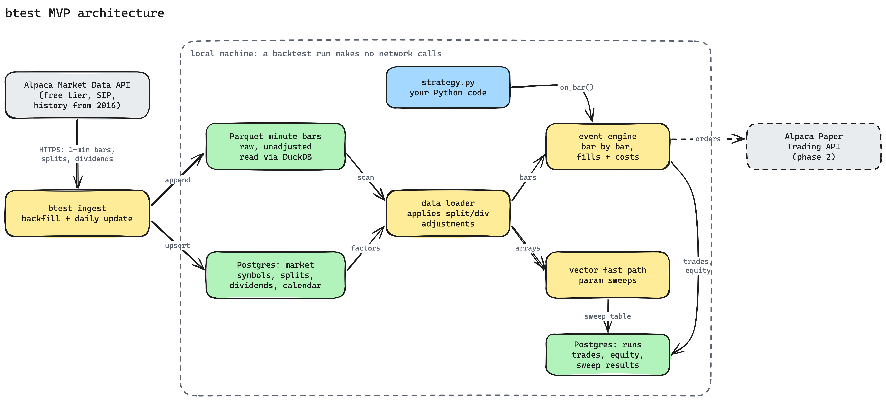

# btest design (MVP)

Status: draft, 2026-10-01. Single user (yelgabo), research and paper trading.



Diagram source: `2026-10-01-btest-architecture.excalidraw`.

## Goal

Test Python trading strategies against minute bars stored locally. A backtest run reads only
local storage and makes no network calls. The data is downloaded once, then kept current
with a daily update.

## Scope

In the MVP:

- US equities, 1-minute bars, a handful of symbols.
- Event-driven backtest engine plus a vectorized fast path for parameter sweeps.
- Results stored in Postgres, with a summary report per run.

Later phases: paper trading through Alpaca, then FX, crypto, and options. The schema keeps an
`asset_class` column from day one so these do not need a migration of existing rows.

## Instruments

SPX is an index. It has no shares and no volume, so a strategy cannot trade it directly. The
MVP uses tradable instruments instead:

| Symbol | Why |
|---|---|
| SPY | ETF that tracks SPX. Real volume, real fills, pays quarterly dividends. |
| META | A single stock. Pays dividends since 2024, no splits. |
| NVDA | Split 4:1 (2021) and 10:1 (2024). Exercises the split adjustment code. |

The symbol list is config, not code.

Picking symbols by hand that exist today is a form of survivorship bias. That is acceptable
for single-asset strategy research. It becomes a problem when a strategy selects from a
universe, which is out of MVP scope.

## Data source

Alpaca Market Data API, free Basic plan:

- Historical minute bars from 2016, consolidated SIP feed. The free plan blocks only the most
  recent 15 minutes, which does not matter for backtests.
- 200 historical API calls per minute.
- The same account provides the paper trading API needed in phase 2.

Fallback: Databento (history from 2018-05-01, $125 free credit on signup). The ingest code
sits behind a `DataSource` interface so a second vendor is one new adapter.

Alpaca's bars endpoint takes an `adjustment` parameter (raw, split, dividend, all). Ingest
stores **raw** bars and fetches corporate actions separately. A one-off check compares our
locally adjusted series against Alpaca's `adjustment=all` output to confirm the adjustment
code.

## Storage

| Store | Holds | Why |
|---|---|---|
| Parquet files, `data/bars/symbol=X/year=Y/` | Raw minute bars | Columnar, compressed, loads into numpy/polars arrays in milliseconds through DuckDB. Bars are append-only. |
| Postgres `market` schema | Symbols (stable internal id), splits, dividends, trading calendar. Ticker history comes later, when a symbol renames. | Small relational data that changes and needs constraints. |
| Postgres `runs` schema | Run config, git commit, params, trades, daily equity, metrics, sweep results | Queryable history of every run. |

Size: about 98k regular-session minute bars per symbol per year, so 10 years of 3 symbols is
roughly 3M rows. Extended hours bars are stored with a `session` flag and excluded by
default.

Bar timestamps are UTC and mark the bar's open. The calendar comes from
`pandas_market_calendars` (NYSE), including half days.

## Data loader

Reads raw bars from Parquet, applies split and dividend adjustment factors from Postgres, and
returns either an event stream (event engine) or aligned arrays (fast path). Adjustment uses
every stored corporate action, matching Alpaca's `adjustment=all`. Events after the backtest
window scale the whole window by a constant, so returns are unchanged. Raw prices stay
available for fill modelling, since real orders fill at raw prices.

## Event engine

The engine loops over bars in time order. It does not wait in real time. "Slow" means Python
calls `strategy.on_bar()` once per bar per symbol, roughly 1M calls for 10 years of one symbol,
which takes tens of seconds. That is fine for one run and too slow for thousands.

Rules that prevent lookahead:

- The strategy sees bar `t` only after bar `t` closes.
- An order placed on bar `t` fills at bar `t+1` open, plus slippage.
- Fills use raw prices; position sizes are adjusted on split dates.

Cost model: commission $0 (Alpaca), configurable slippage in basis points, optional SEC and
FINRA TAF fees on sells.

Strategy interface:

```python
class Strategy:
    params: dict

    def on_start(self, ctx): ...
    def on_bar(self, ctx, bar): ...   # ctx.order(), ctx.position(), ctx.history(n)
    def on_end(self, ctx): ...
```

The same class runs against the paper broker in phase 2. Only the broker adapter changes.

## Vectorized fast path

A strategy may also define `signals(arrays, params) -> target_position_array`. The fast path
computes positions for the whole series at once with numpy, applies the same fill rule
(shifted one bar) and cost model, and finishes a 10-year run in milliseconds.

A **parameter sweep** runs one strategy many times with different settings, for example a
moving-average crossover with fast window 5 to 50 and slow window 20 to 200. The sweep
shows which settings worked and how sensitive the result is to them.

Two safeguards:

- **Parity test.** For each strategy that implements both paths, the test suite runs both on
  the same data and requires matching trades. This catches lookahead bugs in `signals()`.
- **Holdout.** The most recent period (default: 2025-01-01 onward) is excluded from sweeps.
  A sweep picks parameters on older data; the holdout run confirms them once. Walk-forward
  evaluation (re-fit on rolling windows) follows after the MVP.

## Metrics

Per run: total return, CAGR, annualized volatility, Sharpe (risk-free rate from a stored
T-bill series), Sortino, max drawdown and duration, exposure, turnover, trade count, win rate,
and the same figures for SPY buy-and-hold over the same window.

## Stack

Python 3.12+, uv, numpy, polars, DuckDB, psycopg 3, httpx (Alpaca market data REST),
pandas_market_calendars, pytest. alpaca-py arrives with the paper broker in phase 4. Postgres 17 is already running locally on port 5432.

## Phases

1. **Data.** Repo scaffold, Postgres schemas, Alpaca adapter, backfill SPY/META/NVDA from
   2016, daily update command, adjustment check against Alpaca. Done when a local query
   returns adjusted bars that match Alpaca's adjusted series.
   Done 2026-10-02: SPY within 0.01% of Alpaca (small systematic gap from dividend
   prior-close definition, cause open), NVDA and META within Alpaca's 3-decimal rounding.
2. **Event engine.** Strategy interface, fill and cost model, run storage, metrics report,
   one example strategy (moving-average crossover).
3. **Fast path and sweeps.** `signals()` support, parity test, sweep runner with holdout.
4. **Paper trading.** Alpaca paper broker adapter running the same strategy class live.

## Open decisions

- Reporting surface: terminal summary plus HTML report per run, or a notebook. Default:
  terminal summary and a static HTML report.
- Holdout start date.
